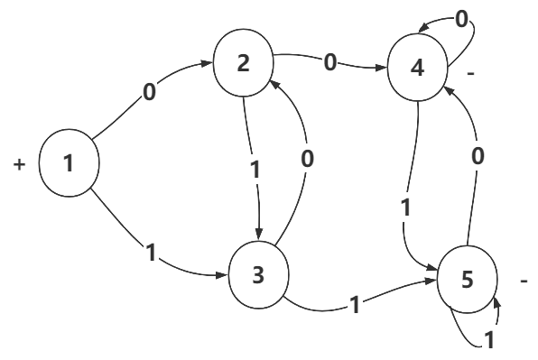
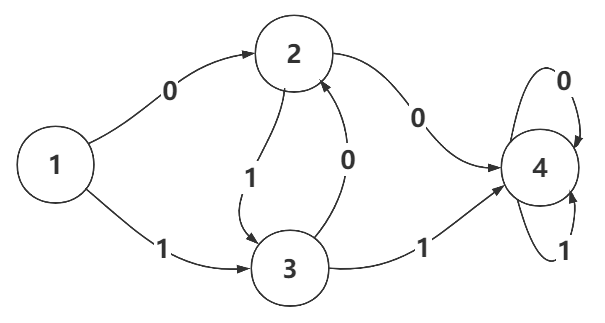

### 第一次作业

1，

（1）有限自动机的确定化

从开始状态集合{1}进行扩展，不断找出新的状态，直到没有新的状态

|         | 0       | 1       |      | 编号 |
| ------- | ------- | ------- | ---- | ---- |
| {1}     | {2,4}   | {3,4}   | +    | 1    |
| {2,4}   | {2,4,5} | {3,4}   |      | 2    |
| {3,4}   | {2,4}   | {3,4,5} |      | 3    |
| {2,4,5} | {2,4,5} | {3,4,5} | -    | 4    |
| {3,4,5} | {2,4,5} | {3,4,5} | -    | 5    |

确定化后的有限自动机的如图

（2）有限自动机的最小化

- 把状态集合分成两个不等价子集：$Q_1$（结束状态集），$Q_2$（非结束状态集）
- 把每个$Q_i$划分成不同的子集：对同一$Q_i$中的两个状态i和j，若对字母表中的某个符号变换到已划分的不同状态集中，则i和j分离（$\delta(i,a)\in Q_m,\delta(j,a)\in Q_n 且 m\neq n$）
- 重复上一个步骤，直到不能在划分为止
- 合并最终划分的每个子集的个状态

$Q_{NE} = \{\{4,5\},\{1,2,3\}\}$

$\delta(\{1,2\},1) = \{3,3\},\delta(\{3\},1)= \{5\}$ //将1，2和3分开

$Q_{NE} = \{\{4,5\},\{1,2\},\{3\}\}$

$\delta(\{1\},0)=\{2\},\delta(\{2\},0)=\{4\}$ //将1和2分开

$Q_{NE}=\{\{1\},\{2\},\{3\},\{4,5\}\}$

所以将$\{1\},\{2\},\{3\},\{4,5\}$看成四个状态

|        | 0      | 1      |      | 编号 |
| ------ | ------ | ------ | ---- | ---- |
| {1}    | {2}    | {3}    | +    | 1    |
| {2}    | {4，5} | {3}    |      | 2    |
| {3}    | {2}    | {4，5} |      | 3    |
| {4，5} | {4，5} | {4，5} | -    | 4    |

状态机如下

