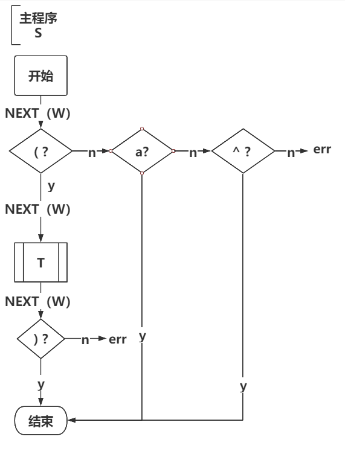
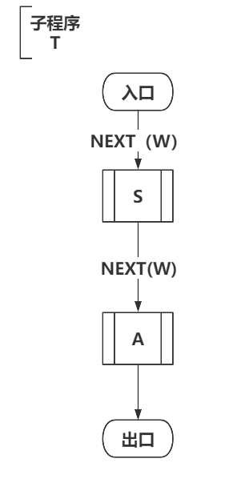
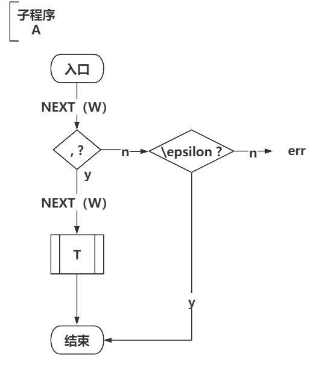

### LL(1)文法定义

具有相同左部的各产生式，其选择符集合不相交

### 递归子程序的构造算法

（1）扩展文法 增设产生式 $Z^*->Z$将$Z^*$的程序作为子程序

（2）首符号读来：子程序的入口 

​		  后继符读来：子程序的出口

（3）子程序的内容设计

​			遇终结符，判定是否与当前单词相等，如果相等，读取下一个

​			遇非终结符，调用该非终结符定义的子程序，返回后继续读下一单词

​			遇$\varepsilon$直接转到出口

###  第二次作业

（1）

LL(1)文法定义：具有相同左部的各产生式，其选择符集合不相交

$S-> a | \wedge  | (T)  $

$T->T,S | S $

***

选择符集合如下

$select(S-> a ) = first(a) = \{a\}$

$select(S->\wedge) = first(\wedge) = \{\wedge\}$

$select(S->(T)) = first((T)) = \{(\}$

$select(T->T,S) =first(T,S) =  \{a,\wedge,(\}$

$select(T->S) =first(S) =  \{a,\wedge,(\}$

***

$T->T,S | S $  包含左递归，选择符集合相同  可将 其改写如下

$T - > SA$

$A - > ,T|\varepsilon$

改写之后：

$select(T->SA) = first(SA) = first(S) =\{a,\wedge,(\} $

$select(A->,T) = first(,SA) = \{',' \}$

$select(A->\varepsilon) = frist(\varepsilon)\cup follow(A) = follow(T) = \{ )\}$

选择符集合不相交

***

综合得 LL(1)文法为：

$S-> a | \wedge  | (T)  $

$T - > SA$

$A - > ,T|\varepsilon$

(2)

流程图为：

  

